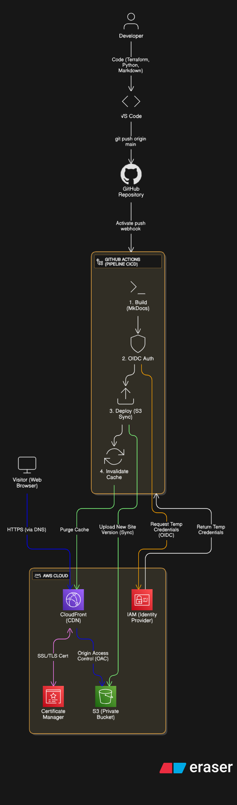

# Cloud Portfolio (Serverless & IaC na AWS)

Bem-vindo ao repositório do meu portfólio profissional.

Este projeto não é apenas um site estático; é uma **Prova de Conceito (PoC)** viva de uma arquitetura **Serverless**, segura e automatizada na AWS. Ele demonstra a aplicação prática de **Infraestrutura como Código (IaC)**, **CI/CD** moderno e **segurança**.

👉 **Acesse o Site:** [https://gpdlportfolio.shop](https://gpdlportfolio.shop)

---

## 🏗️ Arquitetura da Solução

O projeto foi desenhado para ser **Resiliente**, **Seguro** e **Custo-Efetivo (FinOps)**.

### Diagrama de Alto Nível



### Fluxo de Dados:

1. Usuário acessa via HTTPS.
2. **CloudFront (CDN)** entrega conteúdo cacheado na borda (Edge).
3. **S3 (Bucket Privado)** armazena os arquivos estáticos, acessível apenas via OAC (Origin Access Control).
4. **GitHub Actions** realiza o deploy automático via autenticação OIDC (Keyless).

---

## 🛠️ Stack Tecnológica & Decisões

| Componente | Tecnologia | Motivação Técnica |
|------------|------------|-------------------|
| **Cloud Provider** | AWS | Uso de serviços nativos (S3, CloudFront, ACM, IAM, OIDC) para escalabilidade infinita. |
| **IaC** | Terraform | Provisionamento declarativo e reprodutível. O estado da infraestrutura é a única fonte da verdade. |
| **CI/CD** | GitHub Actions | Pipeline automatizado de Build, Auth e Deploy a cada push na branch `main`. |
| **Segurança** | OIDC & OAC | Eliminação de credenciais de longa duração (Access Keys) no GitHub e bloqueio de acesso público ao S3. |
| **Frontend** | MkDocs | Abordagem Docs-as-Code para manutenção simples e focado em conteúdo técnico. |

---

## 🚀 Como Fazer o Deploy (Reprodução)

Este projeto foi construído para ser **reprodutível**. Siga os passos abaixo para criar sua própria versão.

### Pré-requisitos

- Conta AWS Ativa.
- Terraform CLI e AWS CLI instalados.
- Domínio registrado (opcional, mas recomendado).

### 1. Provisionar Infraestrutura

Navegue até a pasta `infra/` e inicialize o Terraform.

```bash
cd infra
terraform init
terraform plan
terraform apply
```

Isso criará:

- Bucket S3 Privado.
- Distribuição CloudFront com OAC.
- Provedor OIDC e Roles IAM para o GitHub Actions.
- Certificado SSL (ACM).

### 2. Configurar CI/CD

No seu repositório GitHub, adicione os seguintes Secrets (gerados pelo `terraform output`):

- `AWS_ROLE_ARN`: O ARN da Role IAM criada para o OIDC.
- `CLOUDFRONT_DISTRIBUTION_ID`: ID da distribuição para invalidação de cache.

### 3. Deploy

Faça um push para a branch `main`. O pipeline irá:

1. Construir o site estático (MkDocs Build).
2. Autenticar na AWS sem chaves (OIDC).
3. Sincronizar arquivos com o S3.
4. Invalidar o cache do CloudFront.

---

## 🛡️ Segurança e FinOps

- **Custo Zero em Ociosidade**: A arquitetura Serverless cobra apenas por requisição/armazenamento. Custo estimado: < $0.10/mês.
- **Zero Trust**: O GitHub Actions assume uma role temporária com permissões mínimas (Least Privilege) apenas para o bucket específico deste projeto.
- **HTTPS Only**: Política de redirecionamento forçado para TLS 1.2+.

---

## 📫 Contato

Estou aberto a oportunidades. E fique à vontade, caso também queira colaborar com o projeto.

- **LinkedIn:** [linkedin.com/in/giovanni-pdl](https://linkedin.com/in/giovanni-pdl)
- **Portfolio:** [gpdlportfolio.shop](https://gpdlportfolio.shop)
